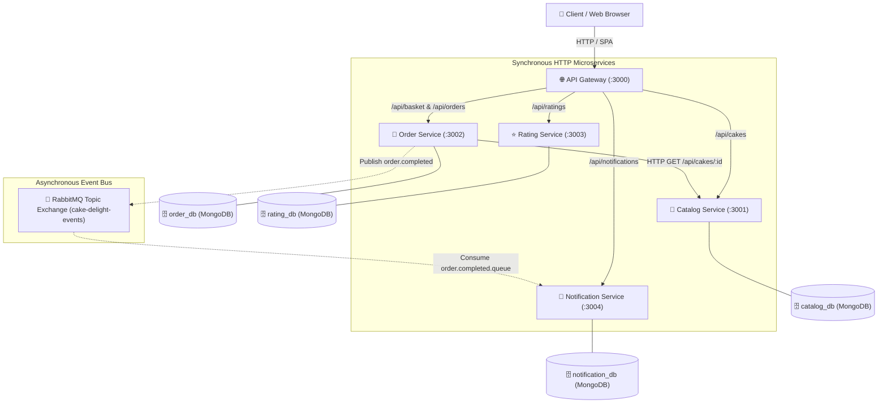

# 🍰 Cake Delight — Cloud-Native Microservices Application

> **Capstone Project Deliverable**  
> A resilient, cloud-native e-commerce microservices platform built with **Node.js, Express, MongoDB, RabbitMQ, Docker, and Kubernetes**.

---

## 📐 1. Architecture Overview

The system uses an **API Gateway pattern** as the single public entry point (`:3000`), routing synchronous client HTTP requests downstream to 4 isolated microservices. Asynchronous event-driven messaging is handled via **RabbitMQ** using a durable topic exchange (`cake-delight-events`).



---

## 🛠️ 2. Technology Stack & Database Isolation

| Concern | Technology Choice |
|---|---|
| **Runtime & Framework** | Node.js (v20) + Express.js |
| **API Gateway** | Express + `http-proxy-middleware` + `express-rate-limit` |
| **Database** | MongoDB (Atlas free tier / Containerised MongoDB 7.0) |
| **ODM** | Mongoose |
| **Message Broker** | RabbitMQ (via `amqplib`) |
| **Frontend** | Single Page Application (Plain HTML5, CSS3, Vanilla JS `fetch`) |
| **Documentation** | OpenAPI / Swagger (`swagger-ui-express` + `swagger-jsdoc`) |
| **Logging & Correlation** | `morgan` (HTTP) + `winston` (App Logs) + `X-Correlation-ID` header |
| **Containers** | Multi-stage Dockerfiles + Docker Compose |
| **Orchestration** | Kubernetes (Minikube manifests with StatefulSets, Deployments, NodePort) |

> **Hard Isolation Rule:** Each service strictly owns its database (`catalog_db`, `order_db`, `rating_db`, `notification_db`). Microservices never share databases or direct code imports.

---

## ⚡ 3. Quick Start — Three Execution Modes

### Mode A: Local Development (Node.js & Local Services)
```bash
# 1. Start local MongoDB (port 27017) and RabbitMQ (port 5672)

# 2. Seed catalog database with 12 cakes
cd catalog-service && npm run seed

# 3. Start services in separate terminals:
cd catalog-service && npm run dev       # :3001
cd rating-service && npm run dev        # :3003
cd notification-service && npm run dev  # :3004
cd order-service && npm run dev         # :3002
cd api-gateway && npm run dev           # :3000

# Open Browser at: http://localhost:3000/
```

---

### Mode B: Containerised Deployment (Docker Compose)
```bash
# Build images and start all 7 containers (Mongo, RabbitMQ, Gateway, 4 Services)
docker-compose up --build -d

# Check status of containers and healthchecks
docker-compose ps

# Access Services:
# - Web SPA & API Gateway: http://localhost:3000
# - RabbitMQ Dashboard:    http://localhost:15672 (guest/guest)
# - Catalog Swagger Docs:  http://localhost:3001/api-docs
```

---

### Mode C: Kubernetes Deployment on Minikube
```bash
# 1. Start Minikube cluster
minikube start

# 2. Point local terminal to Minikube's Docker daemon
eval $(minikube -s socket docker-env)  # (macOS/Linux)
# Or on Windows PowerShell: minikube docker-env | Invoke-Expression

# 3. Build Docker images directly inside Minikube
docker build -t api-gateway:latest ./api-gateway
docker build -t catalog-service:latest ./catalog-service
docker build -t order-service:latest ./order-service
docker build -t rating-service:latest ./rating-service
docker build -t notification-service:latest ./notification-service

# 4. Apply Kubernetes Manifests in order
kubectl apply -f k8s/

# 5. Verify Pods & Services
kubectl get pods -n cake-delight -w

# 6. Expose API Gateway NodePort (30080)
minikube service api-gateway -n cake-delight
```

---

## 📡 4. Complete API Reference Table

| Service | Method | Endpoint | Description |
|---|---|---|---|
| **API Gateway** | `GET` | `/health` | Combined health status of gateway + 4 downstream services |
| **Catalog** | `GET` | `/api/cakes` | List cakes (`?name=`, `?category=`, `?minPrice=`, `?maxPrice=`) |
| **Catalog** | `GET` | `/api/cakes/:id` | Get cake details by ID |
| **Catalog** | `POST` | `/api/cakes` | Admin/Seed creation of new cake |
| **Order** | `GET` | `/api/basket/:userId` | View basket with line item totals & grand total |
| **Order** | `POST` | `/api/basket/:userId/items` | Add item to basket (fetches price via HTTP from Catalog) |
| **Order** | `PUT` | `/api/basket/:userId/items/:cakeId` | Update item quantity in basket |
| **Order** | `DELETE` | `/api/basket/:userId/items/:cakeId` | Remove item from basket |
| **Order** | `POST` | `/api/orders/checkout` | Create order, clear basket, publish `order.completed` event |
| **Order** | `GET` | `/api/orders/:orderId` | Get order details by ID |
| **Order** | `GET` | `/api/orders/user/:userId` | Get user order history |
| **Rating** | `POST` | `/api/ratings` | Submit review (`{ cakeId, userId, stars, comment }`) |
| **Rating** | `GET` | `/api/ratings/cake/:cakeId` | List reviews for a cake |
| **Rating** | `GET` | `/api/ratings/cake/:cakeId/average` | Aggregated average rating & count |
| **Notification**| `GET` | `/api/notifications/user/:userId` | Delivery notification history |

---

## 📩 5. Asynchronous Event Contract (`order.completed`)

- **Exchange:** `cake-delight-events` (`type: topic`, durable: `true`)
- **Queue:** `order.completed.queue` (`durable: true`)
- **Routing Key:** `order.completed`

```json
{
  "eventId": "3c98fa10-2bdf-4d56-b9a1-8d29f864e211",
  "eventType": "order.completed",
  "timestamp": "2026-08-08T13:00:00.000Z",
  "version": "1.0",
  "data": {
    "orderId": "66b4c1234567890abcdef123",
    "userId": "user_123",
    "customerEmail": "customer@example.com",
    "items": [
      {
        "cakeId": "66b4c9876543210fedcba987",
        "cakeName": "Belgian Dark Chocolate Delight",
        "quantity": 2,
        "unitPrice": 34.99,
        "lineTotal": 69.98
      }
    ],
    "totalAmount": 69.98,
    "orderStatus": "CONFIRMED",
    "placedAt": "2026-08-08T13:00:00.000Z"
  }
}
```

---

## 💾 6. Database Schemas

### 1. Catalog DB (`catalog_db.cakes`)
```javascript
{
  name: { type: String, required: true },
  description: { type: String, required: true },
  category: { type: String, enum: ['Chocolate', 'Cheesecake', 'Fruity', 'Vanilla', 'Vegan', 'Custom'] },
  price: { type: Number, required: true },
  imageUrl: { type: String },
  isAvailable: { type: Boolean, default: true }
}
```

### 2. Order DB (`order_db.baskets` & `order_db.orders`)
```javascript
// Basket Schema
{
  userId: { type: String, required: true, unique: true },
  items: [{ cakeId: String, cakeName: String, unitPrice: Number, quantity: Number, lineTotal: Number }],
  grandTotal: Number
}

// Order Schema
{
  userId: { type: String, required: true },
  customerEmail: { type: String, required: true },
  items: Array,
  totalAmount: Number,
  orderStatus: { type: String, default: 'CONFIRMED' },
  placedAt: Date
}
```

### 3. Rating DB (`rating_db.ratings`)
```javascript
{
  cakeId: { type: mongoose.Schema.Types.ObjectId, required: true, index: true },
  userId: { type: String, required: true, index: true },
  stars: { type: Number, min: 1, max: 5 },
  comment: { type: String }
}
// Unique compound index: { cakeId: 1, userId: 1 } (prevents duplicate user ratings per cake)
```

### 4. Notification DB (`notification_db.notifications`)
```javascript
{
  eventId: { type: String, required: true, unique: true }, // Idempotency check key
  orderId: { type: String, required: true },
  userId: { type: String, required: true },
  customerEmail: { type: String, required: true },
  channel: { type: String, default: 'EMAIL' },
  status: { type: String, default: 'DELIVERED' },
  payload: Object,
  deliveredAt: Date
}
```

---

## 🎙️ 7. Five-Minute Viva Demo Video Script

| Timestamp | Section | Key Demonstration Actions & Verbal Defense |
|---|---|---|
| **0:00 - 0:45** | **Architecture Overview** | • Open `http://localhost:3000/`. Highlight API Gateway proxy routing.<br>• Point out `X-Correlation-ID` header and zero shared databases. |
| **0:45 - 1:45** | **Catalog & Filtering** | • Demonstrate live search, category selection (`Vegan`, `Chocolate`), and price range filter.<br>• Explain `express-validator` and Mongo indexes on price/category. |
| **1:45 - 2:30** | **Basket & HTTP Inter-Service Call** | • Add cake to basket. Explain how Order Service calls Catalog Service over HTTP to fetch real prices.<br>• Demonstrate quantity editing (`+`/`-`) and line total math. |
| **2:30 - 3:30** | **Checkout & RabbitMQ Event** | • Click Checkout. Fill email & submit.<br>• Show terminal log: `order.completed` event published to RabbitMQ exchange.<br>• Open Notification Service log showing manual ACK & DB record persistence. |
| **3:30 - 4:15** | **Ratings & Aggregation** | • Click "⭐ Rate" on a cake. Submit 5 stars.<br>• Explain MongoDB `$match` and `$group` aggregation pipeline calculating average rating. |
| **4:15 - 5:00** | **Resilience & K8s** | • Show `/health` endpoint reporting UP/DOWN per service.<br>• Show `docker-compose ps` or `kubectl get pods` displaying 2 replicas for catalog and order services. |

---

## 🛠️ 8. Viva Questions & Defensible Answers

**Q: Why does each microservice have its own separate database?**  
*A:* Independent databases guarantee **loose coupling and autonomous deployment**. If the Order service needs schema modifications, it will not lock or break the Catalog or Rating databases. It also prevents single-point-of-failure database outages.

**Q: What happens if Notification Service crashes mid-processing of a RabbitMQ message?**  
*A:* Notification Service uses **Manual Message Acknowledgement (`noAck: false`)**. The message is only acknowledged AFTER successful persistence to MongoDB. If the container crashes mid-processing, RabbitMQ detects the channel closure and requeues the message for redelivery without data loss.

**Q: How do you prevent duplicate order confirmation emails if RabbitMQ redelivers an event?**  
*A:* Through **Idempotent processing**. The Notification Service checks if `eventId` already exists in `notification_db` before executing email delivery.
